# UI Polish & Responsive Improvements

## Overview

Improve the visual quality, component consistency, and responsive behavior of the boilerplate UI across all pages. This includes refreshing the color palette with a subtle blue accent, replacing bare HTML elements with shadcn components, adding hover/transition effects via a reusable utility class, and introducing `sm:` breakpoints throughout for better tablet/mobile scaling. All custom styling goes in globals.css — no inline or custom CSS on components.

## Quick Links

- [Requirements](./requirements.md) — full requirements and acceptance criteria
- [Action Required](./action-required.md) — manual steps needing human action

## Dependency Graph

```mermaid
graph TD
    task-01-globals-css["01: globals.css Foundation"]
    task-02-layout["02: Layout Sticky Footer"]
    task-03-site-header["03: Site Header Responsive"]
    task-04-site-footer["04: Site Footer Responsive"]
    task-05-home-page["05: Home Page Overhaul"]
    task-06-dashboard["06: Dashboard Page"]
    task-07-chat-page["07: Chat Page"]
    task-08-profile-page["08: Profile Page"]
    task-09-auth-pages["09: Auth Pages"]
    task-10-setup-checklist["10: Setup Checklist"]
    task-11-starter-prompt-modal["11: Starter Prompt Modal"]
    task-01-globals-css --> task-05-home-page
    task-01-globals-css --> task-06-dashboard
    task-01-globals-css --> task-07-chat-page
    task-01-globals-css --> task-08-profile-page
    task-01-globals-css --> task-09-auth-pages
    task-01-globals-css --> task-10-setup-checklist
    task-01-globals-css --> task-11-starter-prompt-modal
    task-02-layout --> task-09-auth-pages
```

## Waves

| Wave | Tasks | Description |
|------|-------|-------------|
| 1 | task-01, task-02, task-03, task-04 | Foundation: globals.css enhancements, layout flex structure, header/footer responsive |
| 2 | task-05, task-06, task-07, task-08, task-09, task-10, task-11 | All pages: Card adoption, responsive breakpoints, component swaps |

## Task Status

### Wave 1
- [x] [task-01-globals-css](./tasks/task-01-globals-css.md) — globals.css color palette, animations, and utility classes
- [x] [task-02-layout](./tasks/task-02-layout.md) — Root layout sticky footer with flex column
- [x] [task-03-site-header](./tasks/task-03-site-header.md) — Header responsive padding and sizing
- [x] [task-04-site-footer](./tasks/task-04-site-footer.md) — Footer responsive padding

### Wave 2
- [ ] [task-05-home-page](./tasks/task-05-home-page.md) — Home page Card adoption + responsive typography
- [ ] [task-06-dashboard](./tasks/task-06-dashboard.md) — Dashboard Card adoption + responsive grid
- [ ] [task-07-chat-page](./tasks/task-07-chat-page.md) — Chat Input swap + sticky form + responsive
- [ ] [task-08-profile-page](./tasks/task-08-profile-page.md) — Profile responsive stacking + grid fixes
- [ ] [task-09-auth-pages](./tasks/task-09-auth-pages.md) — Auth pages animation, shadow, and background
- [ ] [task-10-setup-checklist](./tasks/task-10-setup-checklist.md) — Setup checklist Card adoption
- [ ] [task-11-starter-prompt-modal](./tasks/task-11-starter-prompt-modal.md) — Textarea swap + responsive buttons
